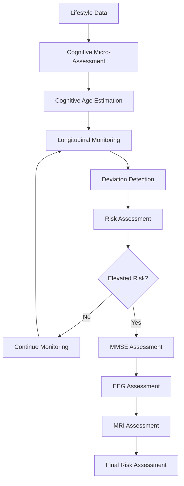
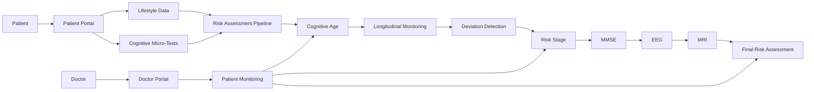

# ALZAWARE

**AI-Driven Cognitive Health Monitoring System**

ALZAWARE is an AI-driven cognitive health monitoring system designed to support early identification of cognitive decline through low-burden assessments, longitudinal monitoring, and a multi-stage risk assessment pipeline.

The system combines lifestyle information and cognitive micro-assessments to estimate **Cognitive Age** and monitor changes over time. When increased risk or significant deviation is identified, the assessment can progress toward more detailed evaluation through **MMSE, EEG, and MRI**.

> **Current status:** This repository contains the active ALZAWARE software prototype and is under continuous development. Some AI and medical-analysis modules currently use prototype or simulated components and will be progressively replaced or expanded with validated implementations.

---

## Project Overview

ALZAWARE follows a progressive assessment approach rather than relying on a single assessment at a single point in time.



The objective is to monitor changes over time and progressively escalate assessment when additional clinical evaluation may be appropriate.

---

## Core Features

### Patient Portal

* Patient authentication
* Lifestyle information collection
* Cognitive micro-tests
* Cognitive Age estimation
* Risk-stage visualization
* Assessment results and reports
* Longitudinal monitoring

### Doctor Portal

* Doctor authentication
* Patient overview
* Patient-specific assessment information
* Cognitive Age and risk information
* Patient detail view
* EEG assessment workflow
* MRI assessment workflow

### Multi-Stage Assessment

* Lifestyle risk assessment
* Cognitive performance assessment
* Cognitive Age estimation
* Longitudinal trend monitoring
* Deviation detection
* Risk-stage classification
* MMSE assessment
* EEG analysis workflow
* MRI analysis workflow

---

## System Architecture

The planned ALZAWARE architecture separates the patient-facing assessment workflow from the doctor-facing monitoring workflow while connecting both to the central assessment and inference pipeline.



---

## Technology Stack

### Frontend

* React
* Vite
* JavaScript / JSX
* CSS

### Application Architecture

* Component-based React architecture
* Context-based application state
* Modular service layer
* AI inference layer
* Prototype backend interfaces

### AI / Machine Learning

The project architecture is being developed to support AI/ML components for:

* Cognitive Age estimation
* Lifestyle-based risk assessment
* EEG analysis
* MRI analysis
* Combined risk assessment

The current repository contains prototype model and inference placeholders. Actual trained and validated models will be integrated as the AI development progresses.

---

## Project Structure

```text
src/
├── ai/
│   ├── inference/
│   ├── models/
│   └── preprocessing/
│
├── backend/
│
├── components/
│
├── context/
│
├── lib/
│
├── pages/
│
├── services/
│
├── App.jsx
├── App.css
└── index.css
```

The structure is being progressively refined as individual modules are implemented and connected.

---

## Development Status

ALZAWARE is currently under active development.

The current prototype establishes the initial frontend architecture and patient/doctor workflows. Development is continuing toward:

* Patient assessment workflows
* Cognitive Age estimation
* Risk-stage calculation
* Longitudinal monitoring
* Deviation detection
* MMSE assessment
* EEG processing
* MRI processing
* Doctor-side patient monitoring
* Backend/API integration
* AI/ML model integration
* Security and data-handling mechanisms

Implementation details may evolve as the project progresses from prototype toward the final system.

---

## Project Objective

The long-term objective of ALZAWARE is to provide a structured cognitive-health monitoring workflow that can identify potential changes earlier and support appropriate escalation to more detailed assessments.

ALZAWARE is intended as a **decision-support and monitoring platform**, not as a replacement for professional medical diagnosis.

---

## Academic / Project Context

ALZAWARE is an engineering project at the intersection of:

* Artificial Intelligence
* Machine Learning
* Cognitive Health
* Digital Healthcare
* Longitudinal Health Monitoring
* Medical Data Analysis

This repository represents the ongoing software implementation of the project.

---

## Current Repository Status

This repository represents the active development version of ALZAWARE.

The system will continue to be updated as additional functionality, AI/ML components, backend services, testing, documentation, and interface improvements are implemented.

---

## License

This project is currently under development for academic and project demonstration purposes.
